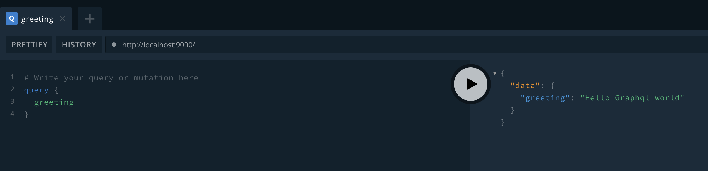

# module 1
- grpah ql solves under and overfetching of resources. underfetching is when in REST, you have to make multiple calls to the server if you need multiple resources.
- graph ql benefit: you describe what's possible with a type system. the schema describe the API.
- tools: GraphiQL, running graphql queries in browser.
- graphql is used over HTTP often, most common.
- apollo server is an easy way to setup a graphql server in javascript. data can be from any sources. open source. apollo server serves over http.

-graphql schema describes what the api can do.
-graphql written  in graphql schema definition language.
- in a schema you always need aquery type, something like this:

```text
const typeDefs = `
  type Query {
    greeting: String
  }
`
```
 contains all possible queries client can make to server. in the above, we can only ask server to give us a greeting.
- gql can parse the schema.  it's from apollo server module. gql is a tag function, it's a function for graphql code to convert string intto an AST for graphql code.
- so teh above is the interface for our API. Now we need an implementation to specify how the server returns a greeting. resolvers do this, just an object.
- resolvers need to match structure of type definitions. Whenever graphql calls for a field, the function for field is called from resolver with matching field. The logic in the resolve can be anything. 
- resolver needs to mirror the type def exactly structure.

- Apollo Server gives you graphql playground at the port. To setup apollo server, it looks like this:

```text
const server = new ApolloServer({typeDefs, resolvers})
server.listen({port: 9000})
  .then(({url}) => console.log(`Server running at ${url}`))
```

you can make queries and graphql playground also gives docs.



the response:

```text
{
  "data": {
    "greeting": "Hello Graphql world"
  }
}
```

notice the top level response key is `data`
- graphql playground is essentially a client. 
- graphql always is a post request.
- request is in json from client. and the query payload is a string, newlines esecaped in json string.
- response is a json object from apollo server.
- since graphql clients just makes requests over http, we can call graphql server from any language as long as it provides http requests.
- if a function is an async function, it returns a promise and so you need to resolve it using `.then`
